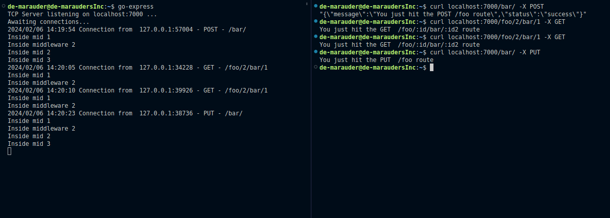

# go-Express


This repo contains an implementation of an HTTP web-server build from scratch (tcp) copying ExpressJS style. If comes with a TCP client that can send HTTP requests to the server

## Features
- Request Logging
- Routing: can parse route tokens (params) and query params from raw HTTP requests
- JSON parsing
- TCP Connection concurrency

## Example Usage
Please check [here](./server/main.go) for a full example 
```go
package main

import (
	"fmt"
	"github.com/de-marauder/go-express/server/server"
)

const (
	host         = "localhost"
	port         = "7000"
)

func main() {
	s := server.NewHTTPServer()

	// register handlers with param tokens and HTTP methods
	s.Get("/", handleRootRoute)
	s.Get("/foo/:id/bar/:id2", handleOneFooBarByIdRoute)
	s.Get("/foo/:id/bar", handleOneFooBarRoute)
	s.Get("/foo/:id", handleOneFooRoute)
	s.Get("/foo", handleFooRoute)
	s.Post("/foo", handlePostFooRoute)
	s.Put("/foo", handleFooRoute)

	s.Listen(host+":"+port, func () {
		// Add some string outputs or
		// run some jobs after server starts
		fmt.Println("Awaiting connections...")
	})
}

// Define handlers //
func handleRootRoute(req *server.HTTPRequest, res *server.HTTPResponse) interface{} {
	res.StatusCode = 200

	// send response using res.Send()
	res.Send("You just hit the " + req.Method + "  /foo route")
	return 1
}

func handleOneFooBarByIdRoute(req *server.HTTPRequest, res *server.HTTPResponse) interface{} {
	fmt.Println(req.Params)
	res.StatusCode = 200
	res.Send("You just hit the " + req.Method + "  /foo/:id/bar/:id2 route")
	return 1
}
func handleOneFooBarRoute(req *server.HTTPRequest, res *server.HTTPResponse) interface{} {
	fmt.Println(req.Params)
	res.StatusCode = 200
	res.Send("You just hit the " + req.Method + "  /foo/:id/bar route")
	return 1
}
func handleOneFooRoute(req *server.HTTPRequest, res *server.HTTPResponse) interface{} {
	fmt.Println(req.Params)
	res.StatusCode = 200
	res.Send("You just hit the " + req.Method + "  /foo/:id route")
	return 1
}
func handleFooRoute(req *server.HTTPRequest, res *server.HTTPResponse) interface{} {
	res.StatusCode = 200
	res.Send("You just hit the " + req.Method + "  /foo route")
	return 1
}

// Handle JSON response using res.Json
func handlePostFooRoute(req *server.HTTPRequest, res *server.HTTPResponse) interface{} {
	res.StatusCode = 200
	type JsonMap map[string]string
	data := make(JsonMap)
	data["message"] = "You just hit the " + req.Method + " /foo route"
	data["status"] = "success"
	res.Json(data)
	return 1
}
func handlePutFooRoute(req *server.HTTPRequest, res *server.HTTPResponse) interface{} {
	res.StatusCode = 200
	res.Send("You just hit the " + req.Method + "  /foo route")
	return 1
}

```

# Author
de-marauder [twitter](https://x.com/De_marauder), [linkedin](https://linkedin.com/in/obiajulu-ezike)
